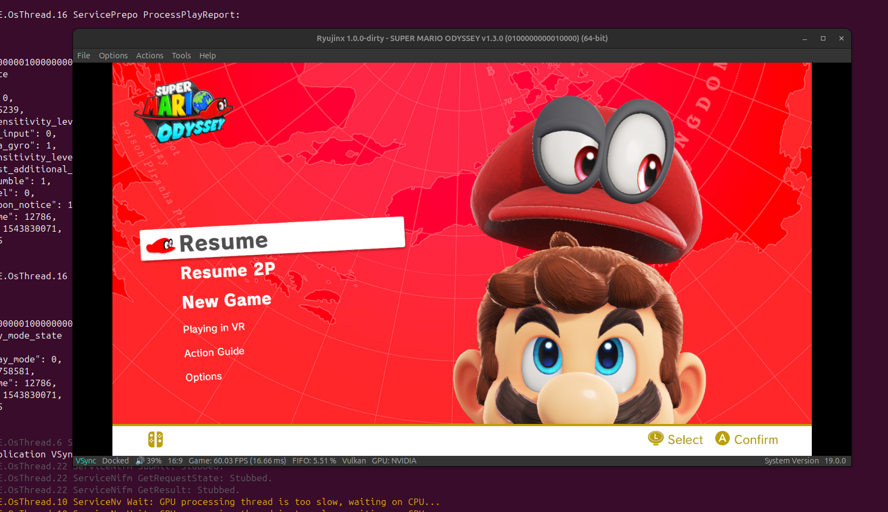
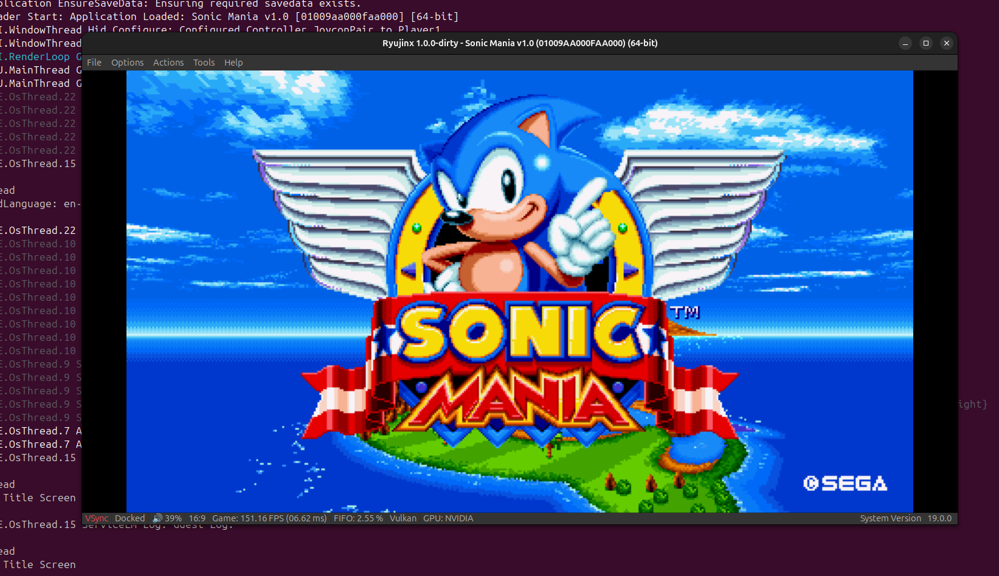
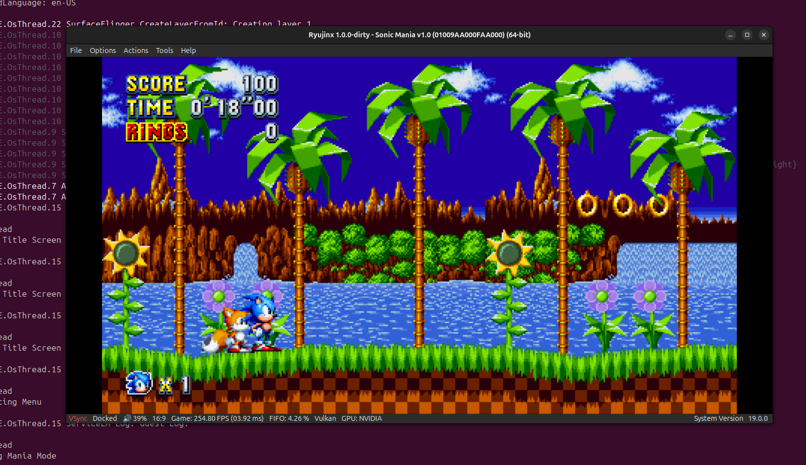

A (Hopefully Multi System) Jit emulator framework written in C++.

Libraries Used:
    https://github.com/herumi/xbyak

Road Plan:

    X86 Backend                         - [in progress]
    Complete arm64 frontend             - [in progress]                                   
    arm64 backend                       - [not started]
    Complete riscv frontend             - [not started]
    Power PC 32                         - [not started]
    Running itself in every frontend    - [not started]
    RUNNING LINUX NO MMU                - [not started]

Accomplishments:

    Using RYUJINX the discontinued nintendo switch emulator, 
    I can test the aarch64 portion of this project.
    
    SCREENSHOTS:
    
   
    
    
    

    Possible nintendo switch emulator written from the ground up in the works??????